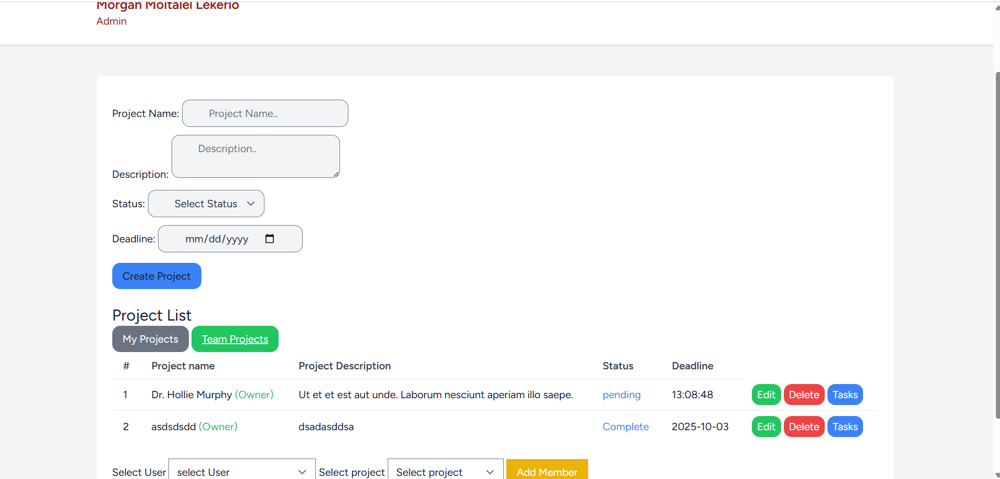

# ProjectFlow — Laravel + Livewire Project Management App

**ProjectFlow** is a team-based project management system built with **Laravel**, **Livewire**, and **Tailwind CSS**.  
It allows teams to collaborate, assign tasks, track progress, and manage projects efficiently in real-time — all from one clean dashboard.


##  Features

-  Multi-user roles (Admin, Manager, Member)
-  Create, edit, and delete projects
-  Assign team members to projects
-  Track project statuses (Active, In Progress, Complete)
-  Set and manage project deadlines
-  Role-based actions (only Admins/Managers can edit or delete)
-  Modern responsive UI using Tailwind CSS
-  Built with Livewire for instant, reactive updates


##  Tech Stack

- **Laravel 11**
- **Livewire**
- **Tailwind CSS**
- **SQLite** 
- **PHP 8+**


## Screenshots

> 

| Dashboard | Tasks | User Profile |
|------------|-----------|-----------|
|  |  |  |

---

## Installation

Follow these steps to set up the project locally:

```bash
# Clone the repository
git clone https://github.com/yourusername/ProjectFlow-Laravel-Livewire.git

# Navigate into the project folder
cd ProjectFlow-Laravel-Livewire

# Install dependencies
composer install
npm install
npm run dev

# Copy the .env file and configure your database
cp .env.example .env

# Generate app key
php artisan key:generate

# Run migrations
php artisan migrate

# Start the server
php artisan serve
